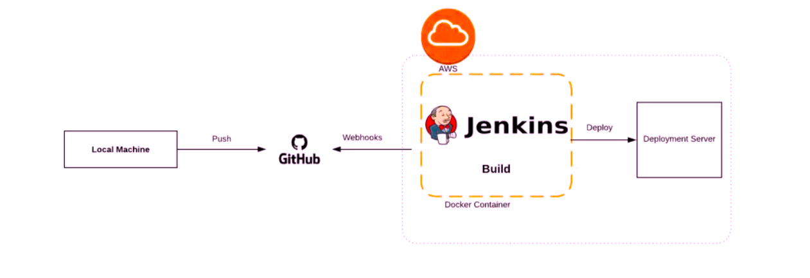
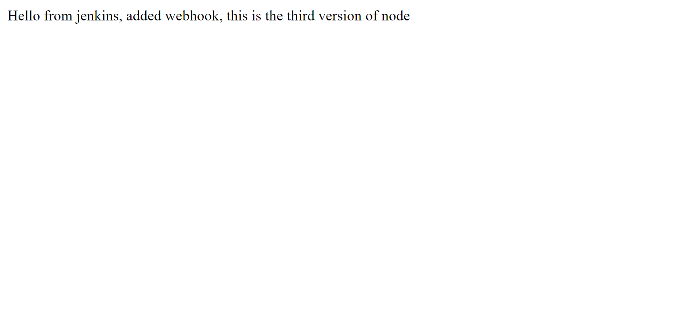

# node-js-app-CICD

## Project Overview

This project demonstrates Node.js application deployment using a Jenkins CI/CD pipeline on AWS EC2 instances.
The pipeline automatically pulls code from GitHub, installs dependencies, builds, and deploys the app on a Node server.

## Architecture 

Developer → GitHub → Jenkins (CI/CD Server) → Node.js Server (Deployment)

## Tools & Services Used

AWS EC2 – For hosting Jenkins and Node.js app

GitHub – For source code version control

Jenkins – For automating CI/CD process

Node.js – Application runtime

PM2 – Process manager to keep app running continuously

Ubuntu – Operating system for servers

## Step-by-Step Setup

### Step 1: Launch Two EC2 Instances

Instance 1: Jenkins Server

Instance 2: Node.js Server

Both instances should:

Use Ubuntu OS

Have proper security group rules (open ports 22, 8080, 3000 if needed)

### step 2: Install Required Packages

On Node.js Server:

sudo apt update
sudo apt install git -y
sudo apt install nodejs npm -y
sudo npm install -g pm2

### Step 3: Push Code to GitHub

git add .
git commit -m "Initial commit - Node CI/CD setup"
git push -u origin main

### Step 4: Create job Jenkins

Install required plugins:

Git

SSH Agent

pipeline

Job Name : node-app-deployment

Add GitHub repo URL in Jenkins project

Add SSH credentials for EC2 Node Server

Create and run a pipeline project using Jenkinsfile

### Step 5: Deployment

Once Jenkins builds successfully:

It connects to the Node server via SSH

Pulls the latest code from GitHub

Installs dependencies

Starts the app with PM2

Verify app is running:

pm2 status

or open in browser:

http://<EC2-NODE-SERVER-IP>:3000

### Step 6 (Optional): Add webhooks

go to github repo setting

Click on webhook

In payload url Add jenkins Server IP and port 8080

update webhook

browser : 

http://<EC2-JENKINS-SERVER-IP>:8080/webhook-url

## Advantages

Fully automated deployment

Reduces manual intervention

Continuous integration and delivery

Easy monitoring with PM2

## Disadvantages

Initial Jenkins setup takes time

Needs SSH key configuration between servers

## Conclusion

You now have a working CI/CD pipeline for Node.js app using Jenkins, GitHub, and AWS EC2 — delivering code changes automatically and reliably.